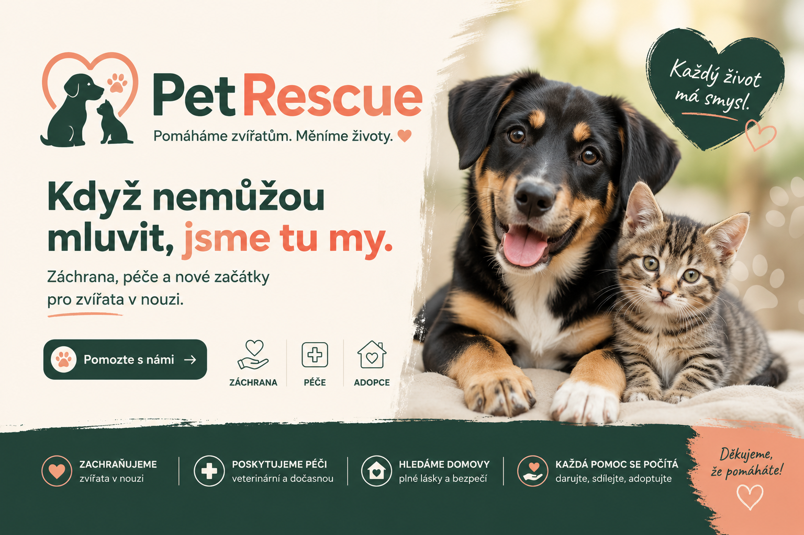
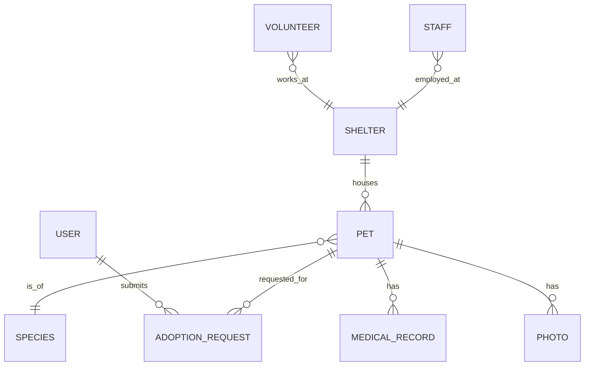
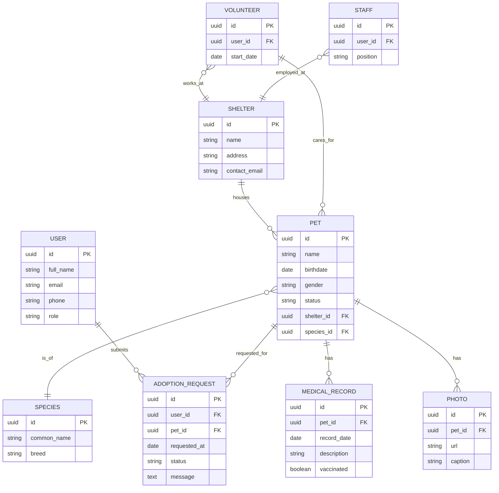

# [PetRescue](https://pslib-cz.github.io/2025-p1a-inf-nis-mrlija)

  

## Použité umělé inteligence

  
  
  
  

## O projektu

PetRescue je moderní informační systém pro zvířecí útulky a záchranné stanice, který digitalizuje a zjednodušuje celý proces adopce.

### Téma

Digitalizace zvířecích útulků a modernizace adopčního procesu.

### Perex

Hledání nového domova pro opuštěná zvířata nebylo nikdy jednodušší. PetRescue je moderní informační systém, který efektivně propojuje záchranné stanice se zájemci o adopci. Zatímco veřejnosti nabízí přehledný online katalog mazlíčků s možností okamžitého podání žádosti, personálu útulku poskytuje silný nástroj pro evidenci svěřenců, správu zdravotních záznamů a rychlou administraci celého schvalovacího procesu. Cílem je minimum papírování a maximum zachráněných životů.

### Cílová skupina

Systém je určen především zaměstnancům a dobrovolníkům zvířecích útulků, záchranných stanic a dalších zařízení pečujících o opuštěná zvířata. Druhou skupinu tvoří veřejnost, tedy lidé, kteří si chtějí zvíře adoptovat, podívat se na jeho profil nebo podat žádost o adopci.

(<a href="#home">zpět na začátek</a>)

## Použitelné technologie

  
  
  
  
  
  
  

(<a href="#home">zpět na začátek</a>)

## ER diagramy

Níže jsou dva návrhy ER diagramu pro systém PetRescue — přehledový diagram a detailní diagram s atributy.

### Přehledový ER diagram

### Detailní ER diagram (atributy)

Pokud chcete exporty do SVG/PNG nebo další rozšíření (např. separátní diagram pro workflow adopce), dejte vědět a doplním je.
